```diff
- NUMBER_QUESTIONS

```

# LogZ
## Descriptif du bot.

LogZ est un programme de bot pour la gestion des log d'un serveur discord codé en Python.
### À quoi sers t'il ?
- Et bien ce bot sers à avoir un oeil sur tout ce qui se passe sur un serveur, les salon seront visible par les administrateur du serveur pour peu qu'ils aient les rôles.

La liste des **modules** à installer avec **pip** se trouve dans le fichier **requirements.txt**
```python
discord.py>=1.7.3
aiosqlite>=0.17.0
python-dotenv>=0.19.2
aiohttp>=3.8.1
```
Pour les installer il suffit d'écrire dans le terminal la commande suivante :
```console
pip install --upgrade -r requirements.txt
```
Il faut également aller dans le fichier ``.env`` et ajouter les informations nécéssaire au bon fonctionnement du bot.
```.env
GUILD_ID=my_guild_id
TOKEN=my_bot_token
```


## Quelles sont les logs gérée par le bot ? 
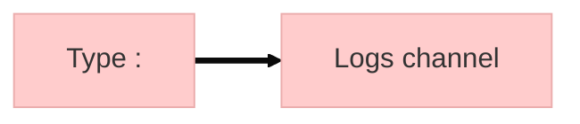
```mermaid
%%{init: {'theme': 'base', 'themeVariables': { 'primaryColor': '#ffcccc', 'edgeLabelBackground':'#fff0f0', 'tertiaryColor': '#fff0f0'}}}%%


        graph LR
          A[Type :]
          A ==> B[Logs channel]
```
### Suppression d'un message
> Pour la suppression d'un message, le bot donnera l'utilisateur qui a poster le message, le contenu supprimé, ainsi que le salon de provenance.
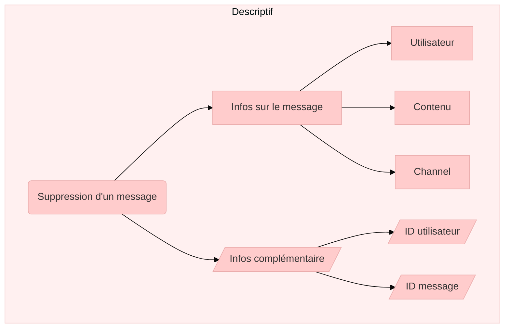
```mermaid
%%{init: {'theme': 'base', 'themeVariables': { 'primaryColor': '#ffcccc', 'edgeLabelBackground':'#fff0f0', 'tertiaryColor': '#fff0f0'}}}%%
        graph TD
          B(Suppression d'un message)
          B --> C[Infos sur le message]
          B --> G[/Infos complémentaire/]
          C --> D[Utilisateur]
          C --> E[Contenu]
          C --> F[Channel]
          G --> H[/ID utilisateur/]
          G --> I[/ID message/]
          subgraph Descriptif
	          B
            C
            D
            E
            F
            G
            H
            I
          end
```
### Modification d'un message
> Pour la modification d'un message, le bot donnera l'utilisateur, le salon de provenance, ainsi que le contenu avant et après la modification.
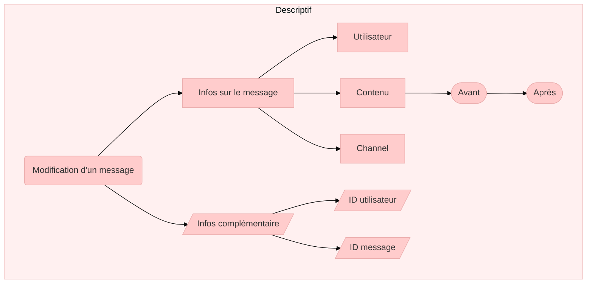
```mermaid
%%{init: {'theme': 'base', 'themeVariables': { 'primaryColor': '#ffcccc', 'edgeLabelBackground':'#fff0f0', 'tertiaryColor': '#fff0f0'}}}%%
        graph TD
          B(Modification d'un message)
          B --> C[Infos sur le message]
          B --> G[/Infos complémentaire/]
          C --> D[Utilisateur]
          C --> E[Contenu]
          C --> F[Channel]
          G --> H[/ID utilisateur/]
          G --> I[/ID message/]
          E --> K([Avant])
          K --> L([Après])
          subgraph Descriptif
            B
            C
            D
            E
            F
            G
            H
            I
            K
            L
          end
```
### Création d'un channel
> Pour la création d'un nouveau channel, le bot donnera le nom, son type (textuel ou vocal) ainsi que sa catégorie si il y en a une. La catégorie est aussi considérée comme un channel, tout ce qui est valable pour le channel le sera pour la catégorie.
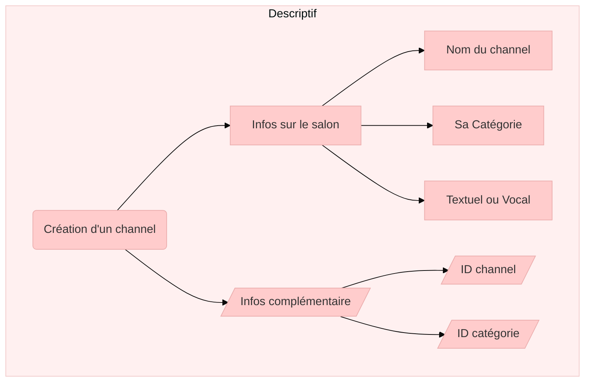
```mermaid
%%{init: {'theme': 'base', 'themeVariables': { 'primaryColor': '#ffcccc', 'edgeLabelBackground':'#fff0f0', 'tertiaryColor': '#fff0f0'}}}%%
        graph TD
          B(Création d'un channel)
          B --> C[Infos sur le salon]
          B --> G[/Infos complémentaire/]
          C --> D[Nom du channel]
          C --> E[Sa Catégorie]
          C --> F[Textuel ou Vocal]
          G --> H[/ID channel/]
          G --> I[/ID catégorie/]
          subgraph Descriptif
            B
            C
            D
            E
            F
            G
            H
            I
          end
```
### Suppression d'un channel
> Pour la suppression d'un channel, le bot donnera le nom, son type (textuel ou vocal) et sa catégorie si il y en a une. La catégorie est aussi considérée comme un channel, tout ce qui est valable pour le channel le sera pour la catégorie..
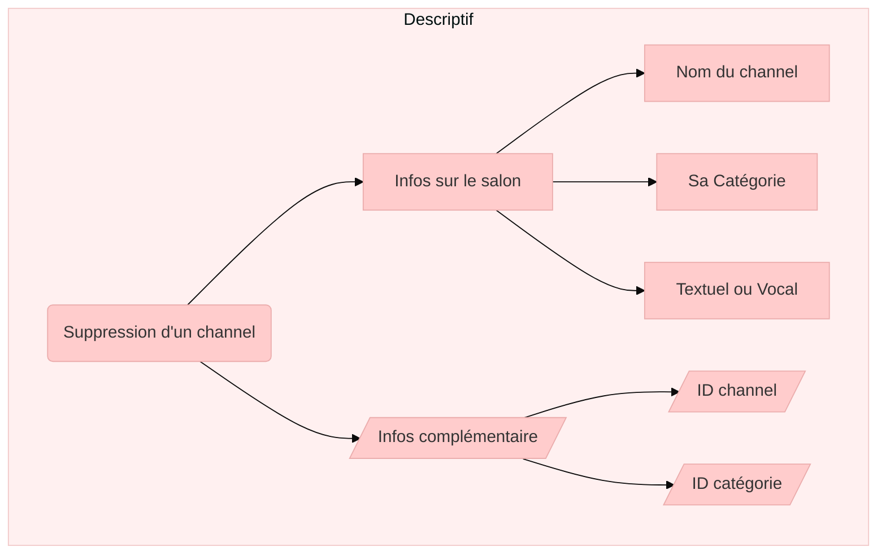
```mermaid
%%{init: {'theme': 'base', 'themeVariables': { 'primaryColor': '#ffcccc', 'edgeLabelBackground':'#fff0f0', 'tertiaryColor': '#fff0f0'}}}%%
        graph TD
          B(Suppression d'un channel)
          B --> C[Infos sur le salon]
          B --> G[/Infos complémentaire/]
          C --> D[Nom du channel]
          C --> E[Sa Catégorie]
          C --> F[Textuel ou Vocal]
          G --> H[/ID channel/]
          G --> I[/ID catégorie/]
          subgraph Descriptif
            B
            C
            D
            E
            F
            G
            H
            I
          end
```
### Modification d'un channel
> Pour la modification d'un channel, le bot donnera le nom du salon avant et après la modification, sa catégorie si il y en a une et son type (textuel ou vocal). La catégorie est aussi considérée comme un channel, tout ce qui est valable pour le channel le sera pour la catégorie.
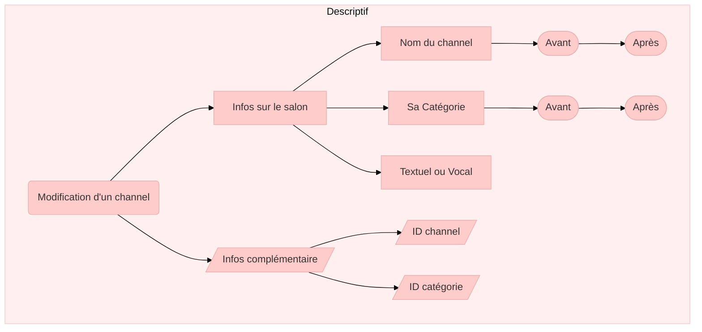
```mermaid
%%{init: {'theme': 'base', 'themeVariables': { 'primaryColor': '#ffcccc', 'edgeLabelBackground':'#fff0f0', 'tertiaryColor': '#fff0f0'}}}%%
        graph TD
          B(Modification d'un channel)
          B --> C[Infos sur le salon]
          B --> G[/Infos complémentaire/]
          C --> D[Nom du channel]
          C --> E[Sa Catégorie]
          C --> F[Textuel ou Vocal]
          G --> H[/ID channel/]
          G --> I[/ID catégorie/]
          D --> J([Avant])
          J --> K([Après])
          E --> L([Avant])
          L --> M([Après])
          subgraph Descriptif
            B
            C
            D
            E
            F
            G
            H
            I
            J
            K
            L
            M
          end
```
### Infos sur les channel vocaux (Utilisateurs)
> Pour les informations sur les channel vocaux, le bot donnera les utilisateurs qui rejoignent un salon vocal, ou si l'utilisateur le quitte, ainsi que le changement pour un channel x vers y.
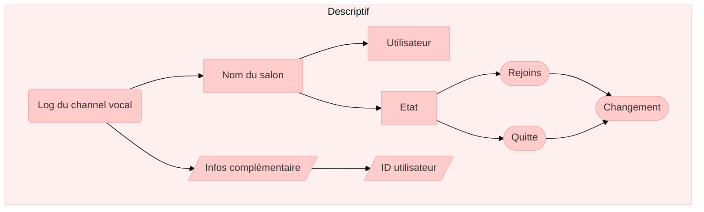
```mermaid
%%{init: {'theme': 'base', 'themeVariables': { 'primaryColor': '#ffcccc', 'edgeLabelBackground':'#fff0f0', 'tertiaryColor': '#fff0f0'}}}%%
        graph TD
          B(Log du channel vocal)
          B --> C[Nom du salon]
          B --> G[/Infos complémentaire/]
          C --> D[Utilisateur]
          C --> F[Etat]
          F --> I([Rejoins])
          F --> K([Quitte])
          I --> L([Changement])
          K --> L
          G --> H[/ID utilisateur/]
          subgraph Descriptif
            B
            C
            D
            F
            G
            H
            I
            K
            L
          end
```
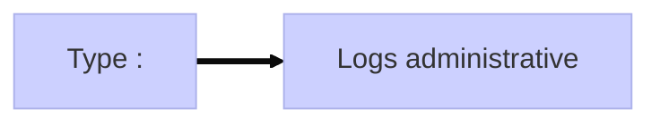
```mermaid
%%{init: {'theme': 'base', 'themeVariables': { 'primaryColor': '#ccd0ff', 'edgeLabelBackground':'#f0f1ff', 'tertiaryColor': '#f0f1ff'}}}%%


        graph LR
          A[Type :]
          A ==> B[Logs administrative]
```
### Arrivée d'un utilisateur
*Le message est entièrement personnalisable, nous verrons plus bas comment le configurer
> Pour l'arrivée d'un utilsateur, le bot affichera le message dans le salon qui aura été configuré à cet effet, nous verrons plus bas dans le descriptif des commandes comment configurer ces messages.

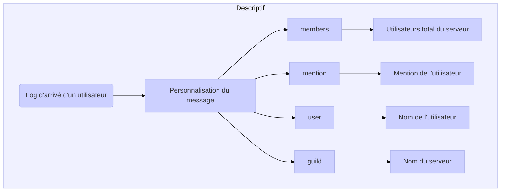
```mermaid
%%{init: {'theme': 'base', 'themeVariables': { 'primaryColor': '#ccd0ff', 'edgeLabelBackground':'#f0f1ff', 'tertiaryColor': '#f0f1ff'}}}%%
        graph TD
          A(Log d'arrivé d'un utilisateur)
          A --> B[Personnalisation du message]
          B --> C[members]
          B --> D[mention]
          B --> E[user]
          B --> F[guild]
          C --> I[Utilisateurs total du serveur]
          D --> J[Mention de l'utilisateur]
          E --> K[Nom de l'utilisateur]
          F --> L[Nom du serveur]
          subgraph Descriptif
	          A
	          B
	          C
	          D
	          E
	          F
	          I
	          J
	          K
	          L
          end
```
### Départ d'un utilisateur
*Le message est entièrement personnalisable, nous verrons plus bas comment le configurer
> Pour le départ d'un utilsateur, le bot affichera le message dans le salon qui aura été configuré à cet effet, nous verrons plus bas dans le descriptif des commandes comment configurer ces messages.
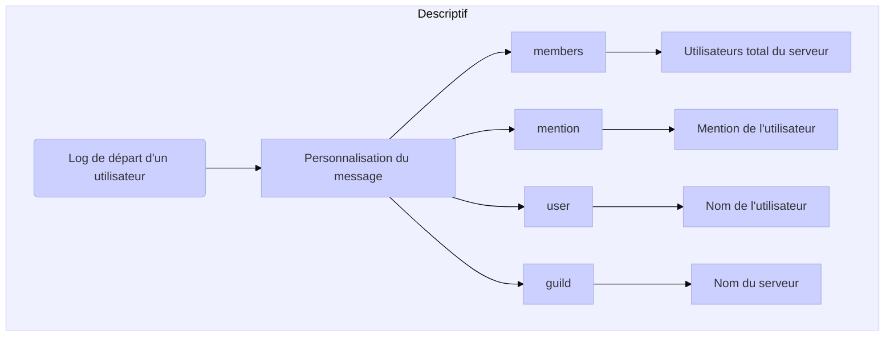
```mermaid
%%{init: {'theme': 'base', 'themeVariables': { 'primaryColor': '#ccd0ff', 'edgeLabelBackground':'#f0f1ff', 'tertiaryColor': '#f0f1ff'}}}%%
        graph TD
          A(Log de départ d'un utilisateur)
          A --> B[Personnalisation du message]
          B --> C[members]
          B --> D[mention]
          B --> E[user]
          B --> F[guild]
          C --> I[Utilisateurs total du serveur]
          D --> J[Mention de l'utilisateur]
          E --> K[Nom de l'utilisateur]
          F --> L[Nom du serveur]
          subgraph Descriptif
	          A
	          B
	          C
	          D
	          E
	          F
	          I
	          J
	          K
	          L
          end
```
### Ban d'un utilisateur
> Pour le ban d'un utilisateur, le bot viens récuperer dans l'historique des serveurs Discord les utilisateurs qui ont été banni, le message contiendra donc l'utilisateur en question ainsi que le motif du bannissement. **Attention toutefois, le message peut mettre du temps voir ne jamais arriver, car les serveurs ne s'actualise pas toute les secondes, comme le bot vient chercher dans l'état des machines..**
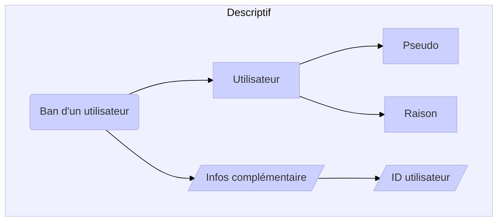
```mermaid
%%{init: {'theme': 'base', 'themeVariables': { 'primaryColor': '#ccd0ff', 'edgeLabelBackground':'#f0f1ff', 'tertiaryColor': '#f0f1ff'}}}%%
        graph TD
          A(Ban d'un utilisateur)
          A --> B[Utilisateur]
          B --> C[Pseudo]
          B --> D[Raison]
	        A --> E[/Infos complémentaire/]
	        E --> F[/ID utilisateur/]
          subgraph Descriptif
						A
						B
						C
						D
						E
						F
          end
```
### Déban d'un utilisateur
> Pour le déban d'un utilisateur, le bot viens récuperer dans l'historique des serveurs Discord les utilisateurs qui ont été banni, le message contiendra donc l'utilisateur en question ainsi que le motif du bannissement. **Attention toutefois, le message peut mettre du temps voir ne jamais arriver, car les serveurs ne s'actualise pas toute les secondes, comme le bot vient chercher dans l'état des machines..**
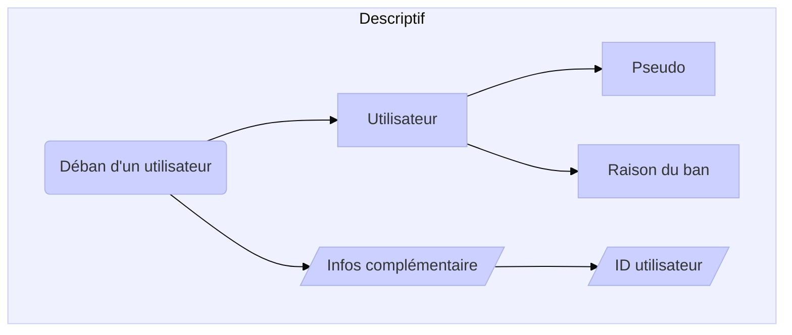
```mermaid
%%{init: {'theme': 'base', 'themeVariables': { 'primaryColor': '#ccd0ff', 'edgeLabelBackground':'#f0f1ff', 'tertiaryColor': '#f0f1ff'}}}%%
        graph TD
          A(Déban d'un utilisateur)
          A --> B[Utilisateur]
          B --> C[Pseudo]
          B --> D[Raison du ban]
	        A --> E[/Infos complémentaire/]
	        E --> F[/ID utilisateur/]
          subgraph Descriptif
						A
						B
						C
						D
						E
						F
          end
```
### Création d'un rôle
> Pour la création d'un rôle le bot affichera la mention du rôle (les mention ne fonctionnent pas dans un embed.. C'est purement esthétique..)
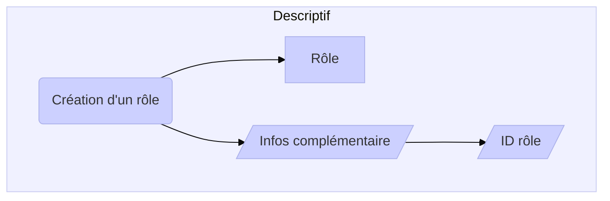
```mermaid
%%{init: {'theme': 'base', 'themeVariables': { 'primaryColor': '#ccd0ff', 'edgeLabelBackground':'#f0f1ff', 'tertiaryColor': '#f0f1ff'}}}%%
        graph TD
          A(Création d'un rôle)
          A --> B[Rôle]
	        A --> C[/Infos complémentaire/]
	        C --> D[/ID rôle/]
          subgraph Descriptif
						A
						B
						C
						D
          end
```
### Suppression d'un rôle
> Pour la suppression d'un rôle le bot affichera le nom du rôle.
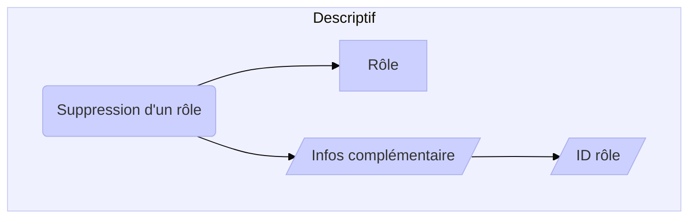
```mermaid
%%{init: {'theme': 'base', 'themeVariables': { 'primaryColor': '#ccd0ff', 'edgeLabelBackground':'#f0f1ff', 'tertiaryColor': '#f0f1ff'}}}%%
        graph TD
          A(Suppression d'un rôle)
          A --> B[Rôle]
	        A --> C[/Infos complémentaire/]
	        C --> D[/ID rôle/]
          subgraph Descriptif
						A
						B
						C
						D
          end
```
###  Modification d'un rôle
> Pour la modification d'un rôle, le bot affichera son ancien nom, et la mention du nouveau nom. (Les mentions ne fonctionnent pas dans un embed.)
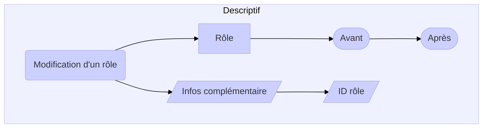
```mermaid
%%{init: {'theme': 'base', 'themeVariables': { 'primaryColor': '#ccd0ff', 'edgeLabelBackground':'#f0f1ff', 'tertiaryColor': '#f0f1ff'}}}%%
        graph TD
          A(Modification d'un rôle)
          A --> B[Rôle]
          B --> C([Avant])
          C --> D([Après])
	        A --> E[/Infos complémentaire/]
	        E --> F[/ID rôle/]
          subgraph Descriptif
						A
						B
						C
						D
						E
						F
          end
```
### Modication d'un utilisateur
> Pour la modification d'un utilisateur le bot prendra en compte plusieurs éléments :
> - Si l'utilisateur obtient ou perd un rôle, le message contiendras donc le rôle en question.
> - Si l'utilisateur change de pseudo interne au serveur (l'alias), alors le bot affichera l'alias avant et après modification (utile pour les serveurs RP)
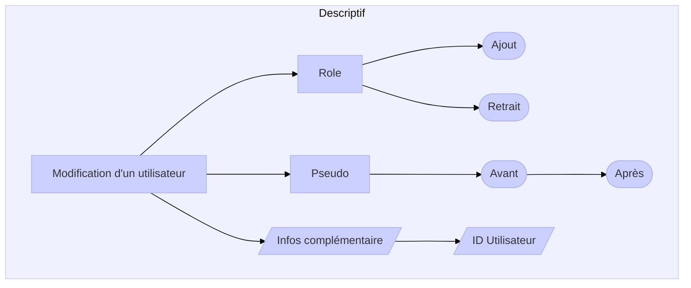
```mermaid
%%{init: {'theme': 'base', 'themeVariables': { 'primaryColor': '#ccd0ff', 'edgeLabelBackground':'#f0f1ff', 'tertiaryColor': '#f0f1ff'}}}%%
        graph TD
          A[Modification d'un utilisateur]
          A --> B[Role]
          A --> C[Pseudo]
          A --> D[/Infos complémentaire/]
          B --> E([Ajout])
          B --> F([Retrait])
          C --> G([Avant])
          G --> H([Après])
          D --> I[/ID Utilisateur/]
          subgraph Descriptif
						A
						B
						C
						D
						E
						F
						G
						H
						I
          end
```
## Quels sont les fonctions du bot ?
Le bot contient tout un panel de fonctions utiles, et obligatoire pour son besoin (il ne contient aucune fonctions d'administration... Son but premier étant de surveiller les logs du serveur.)

### **Les trois premières fonctions qui ne concernent pas directement les logs :**
- **change_prefix**
	- Cette fonction permet de changer le préfixe du bot (par défaut ``!``).
- **show_prefix**
	- Cette fonction permet d'afficher le préfixe du bot (il est également afficher dans le statut du bot).

- **help**
	- Cette fonction est un peu particulière appellée sans paramètre, elle permet d'afficher un listing complet des modules (cogs) du bot comme le montre cette image : 


- En revanche c'est également une fonction qui prend des paramètres, les noms des cogs seront toujours affiché avec une majuscule, et les fonctions toujours en miniscules. Donc si je veux savoir les fonctions qui sont contenue dans le modules ``Help`` ou bien ``CogSetupLog`` il me suffit de les appeler comme ci dessous :
	


- De cette même manière je peux savoir pour les fonctions, afin de connaître leurs syntaxe, si c'est une fonction qui s'utilise avec ou sans paramètres :
	


### Les fonctions pour la configuration des logs :
-  **setup_channel**
  - Cette fonction permet de créer le channel qui sera utilisé pour l'envoie des messages de logs relatives aux channel. Son nom par défaut est ``🤖│channel-logs`` et il est créer dans la catégorie ``LOGS`` par défaut, vous pourrez le renommer ou l'affecter à une catégorie. Ce salon est réservé aux permissions administrateur.
- **setup_admin**
  - Cette fonction comme la précédente permet de créer le channel qui sera utilisé pour l'envoi des messages de logs relatives à l'administration (utilisateurs principalement). Son nom par défaut est ``🤖│admin-logs`` et il est créer dans la catégorie ``LOGS``qui sera également créer. Ce salon est réservé aux permissions administrateur.
- **delete_log_db**
  - Cette fonction permet simplement de supprimer les salons et de retirer les liens de la base de données. Il faut supprimer les salons avec cette fonctions, autrement il restera des traces dans la base de données et cela peu causer des bugs.

### Pour la configuration des messages d'arrivée et de bienvenue :
### Pour les arrivée.
- La fonction principale est **welcome** sur laquelle viens se greffer deux autres fonction **channel** et **message**. Si vous entrez la fonction **welcome** sans rien un message vous sera retourné vous indiquant comment se servir de cette fonction. 
  - Pour configurer le channel d'envoie pour la fonction **welcome** :
```
!welcome channel #salon
```
			
-	Pour configurer le message, cette fonction prend donc plusieurs arguement :
	-	**user** : nom de l'utilisateur
	-	**mention** : mention de l'utilisateur
	-	**guild** : nom du serveur
	-	**members** : total des membres du serveurs
Pour comprendre l'exempe voici le message que je vais rentrer :
*Attention toutefois, les pseudo avec certain caractère spéciaux ne sont pas pris en charge, il seront donc mal afficher dans discord.*

```
!welcome message
Bonjour {mention} ton pseudo est bien {user} ?
Très bien, nous te souhaitons la bienvenue sur {guild}.
Nous sommes actuellement {members} sur ce serveur.
```
Ce qui me donneras :


**Pour les modifications il me suffit simplement de rappeler les fonctions en choisissant un autre channel ou un autre message et ils seront enregistrer dans la base de données.**

### Pour les départs
- La fonction principale est **leave** sur laquelle viens se greffer deux autres fonction **log_channel** et **log_message**. Si vous entrez la fonction **leave** sans rien un message vous sera retourné vous indiquant comment se servir de cette fonction. 
  - Pour configurer le channel d'envoie pour la fonction **leave** :
```
!leave log_channel #salon
```
			
-	Pour configurer le message, cette fonction prend donc plusieurs arguement :
	-	**user** : nom de l'utilisateur
	-	**mention** : mention de l'utilisateur
	-	**guild** : nom du serveur
	-	**members** : total des membres du serveurs
Pour comprendre l'exempe voici le message que je vais rentrer :
*Attention toutefois, les pseudo avec certain caractère spéciaux ne sont pas pris en charge, il seront donc mal afficher dans discord.*

```
!leave log_message
Au-revoir {mention} ton pseudo était-il bien {user} ?
Tant pis nous membre de {guild} le saurons jamais.
Nous sommes actuellement {members} sur ce serveur après son départ.
```
Ce qui me donneras :


**Faîtes bien attention pour ``leave`` c'est ``log_message`` et ``log_channel`` car sinon les fonctions entrent en conflit et ce n'est pas souhaitable.. :/**

## Conclusion
Vous savez tout ce qu'il faut sur ce bot, si vous avez des doutes, retournez sur cette documentation afin de revoir l'utilisation des fonctions. Si un jour vous avez un bug avec votre base de données, elle est probablement corrompues dû à une mauvaise utilisation des fonctions.. Supprimez là et reprenez depuis le début. Les fichiers se trouvent dans le pos GitHub.
Se programme ne sera probablement pas modifié (aucune fonctions ne sera ajoutées, mais elle seront optimisée, je pense notamment à la gestion des logs et pour les fonctions de **welcome** et **leave** qui portent à confusion..).
